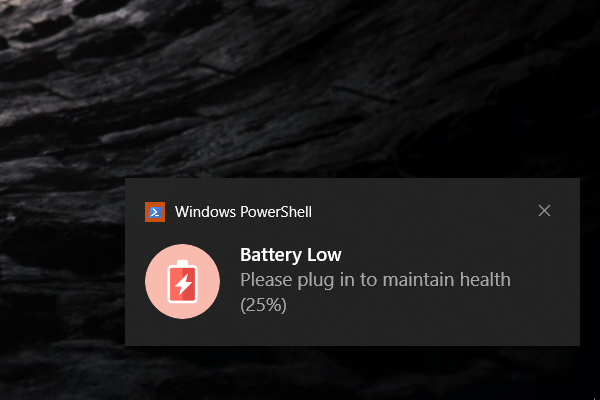
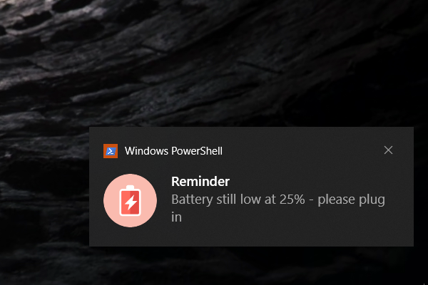
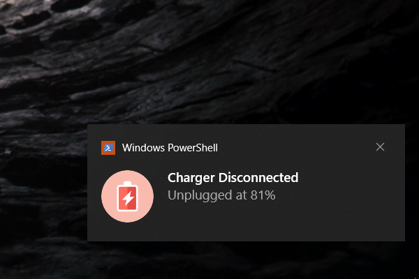

# 🔋 BatteryBuddy

**BatteryBuddy** is a lightweight AutoHotkey utility to help extend battery health by reminding you to:
- ⚡ Unplug at 80%
- 🔌 Plug in at 25%
- 🔕 Mute notifications temporarily when away

---
## 🚀 Features

- System tray icon updates dynamically:
  - 🟢 Green = Charging
  - 🔴 Red = On Battery
- Toast notifications:
  - At 80% — "Unplug for better lifespan"
  - At 25% — "Please plug in to maintain health"
- Repeats reminders every 2 minutes until action taken
- Manual mute for:
  - ⏱️ 30 minutes
  - ⏱️ 1 hour
  - 🔈 Unmute anytime

---

## 🖼️ Screenshots

| Tray Icon (On Battery)                | Battery Low @ 25%                                 | Still Not Charging @ 25%                         | Charger Disconnected @ 81%                              |
| ------------------------------------- | ------------------------------------------------- | ------------------------------------------------ | ------------------------------------------------------- |
|  |  |  |  |

| Tray Icon (Charging)                      | Battery Full @ 80%                                   | Still Charging @ 80%                             | Charger Connected                              |
| ----------------------------------------- | ---------------------------------------------------- | ------------------------------------------------ | ---------------------------------------------- |
|  |  |  |  |

---

## 🛠 Usage

### 🔸 If you have AutoHotkey:
1. Download or clone this repo
2. Run `batteryBuddy.ahk`

### 🔸 Without AutoHotkey?

📦 Just download the `.exe` from the [**Releases section**](https://github.com/AryanXPatel/BatteryBuddy/releases), no installation needed:

1.  Go to [Releases](https://github.com/AryanXPatel/BatteryBuddy/releases)
    
2.  Download `batteryBuddy.exe`
    
3.  Double-click to run — it stays in your system tray and starts monitoring!

---

## 📦 Build `.exe` Yourself (Optional)

If you'd like to build your own `.exe`:
1. Install [AutoHotkey](https://www.autohotkey.com/)
2. Right-click `batteryBuddy.ahk` → “Compile Script”
3. The `.exe` will be generated in the same folder

---

## 🤝 Contribute / Fork

This is a small personal utility — feel free to fork and customize as you like.

---

## 📄 License

MIT License — free for personal and commercial use

